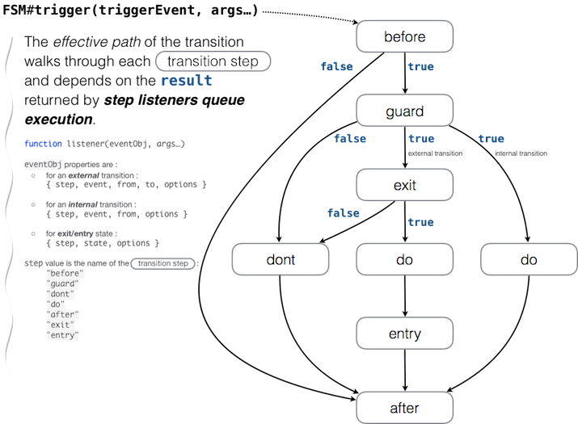

# FSM #

On [https://github.com/jguillod/imed-javascript-finite-state-machine](https://github.com/jguillod/imed-javascript-finite-state-machine).

### Getting started ###

This library is very easy to use. Actually! So, dont be afraid in front of some advanced features explained in detailed here.

#### Installation ####

	npm install @imed.ch/javascript-finite-state-machine --save

This installation process will install the `imed-javascript-finite-state-machine` module and&nbsp;:

- create a `build/` directory with library minification;
- create a `docs/` directory;
- run the tests.

#### Demo ####

Just open (double-click) file `./demo/index.html` in your web browser.

#### API Documentation ####

Try the direct link [FSM API](FSM.html).

To display on OSX run&nbsp;:

	node node_modules/imed-javascript-finite-state-machine/docs/index

or&nbsp;:

	cd path/to/imed-javascript-finite-state-machine
	npm run show-docs

or on other OS you can just open `./docs/imed-javascript-finite-state-machine/<version>/index.html` file (replace `<version>` with actual version, e.g. `1.0.0`).

#### Example of a machine ####

In a bash Terminal launch NodeJS, e.g.&nbsp;:

	$ node

then run the following code&nbsp;:

	var FSM = require('./build/fsm.min.js');
	var configs = {
		"_": {
			"version": "1.0.0",
			"namespace": "ch.imed.test.1.0.0",
			"initial": "dirty",
			"debug": false
		},
		// ----- STATES :
		"dirty": {
			"actions": {
				"edit": function(){},
				"undo": function(){},
				"redo": function(){}
			}
		},
		"saving": {
			"actions": {
				save: function(cb, doSuccess){
					// simulate an asynchronous Ajax request : cb(err, data) will be called with an error depending on doSuccess (just for simulation)
					setTimeout(function(err, data){
						cb(doSuccess ? null:'some error', doSuccess ? 'some data':null);
					}, 300);
				},
				me: function(me){ return me || this; }
			}
		},
		"saved": {
			"exit": function(eventObj, flag){ return flag !== false /* calling fsm.trigger("edit", false) will cancel the transition */},
			"actions": {}
		},
	
		// ----- TRANSITIONS :
		"save": {
			"from": "dirty",
			"to": "saving",
			"guard" : function(eventObj, flag){
				return flag !== false;
			}
		},
		"success": {
			"from": "saving",
			"to": "saved",
			"before": function(e, flag){ return flag !== false /* calling fsm.trigger("success", false) will cancel the transition */ }
		},
		"failure": {
			"from": "saving",
			"to": "dirty"
		},
		"edit": {
			"from": "saved",
			"to": "dirty"
		}
	};
	
	var fsm = new FSM(configs, function(machine){
		console.log('Machine ready');
		console.log('Current state is', machine.current());
		console.log('Available events:', machine.availEvents());
		machine.trigger('save');
		console.log('Current state is now', machine.current());
		console.log('Available events:', machine.availEvents());
	});
	
which produces in the console&nbsp;:

	Machine ready
	Current state is dirty
	Available events: [ 'save' ]
	Current state is now saving
	Available events: [ 'success', 'failure' ]
	
then, try executing&nbsp;:

	console.log(`Current state is now ${fsm.current()}`);
	// => Current state is now saving

	console.log('Available events:', fsm.availEvents());
	// => Available events: [ 'success', 'failure' ]

	fsm.trigger('success');
	// => true

	fsm.current();
	// => 'saved'
	
	console.log('Available events:', fsm.availEvents());
	// => Available events: [ 'edit' ]

and so on.

#### Other Examples ####

> Look at the examples in folder `demo`.  
> Also, look at the code in folder `test`.

---

## About Finite State Machine ##

See UML handbooks or [UML state machine on Wikipedia](https://en.wikipedia.org/wiki/UML_state_machine) for finite state machine (FSM) description. Our library is intended for a simple FSM, without substates, join or fork states.

A FSM can be described as a set of relations of the form&nbsp;:

	Object(O) : State(S) x Event(E) → Transition (T), State(S')

which means an object O in a state S under the dispatched of an event E should perform the Transition T to enter a new state S'.

## Transitions ##

A **Transition** is formalised as&nbsp;:

	event(arguments) [guard] / do:function(event, arg...);dont:function(event, arg...)

## States ##

A **State** is formalised as&nbsp;:

	state / exit:function(event, arg...);enter:function(event, arg...);actions:function...
	
**entry** and **exit** actions provide means for guaranteed initialization and cleanup. **actions** are the actions available (allowed to run) in the corresponding state.

## No Asynchronous Transitions, please&nbsp;! ##

In page 73 of *The Unified Modeling Language Reference Manual* (1999, Addison Wesley Longman, Inc), James Rumbaugh & al wrote about transition action&nbsp;:

> «&nbsp;*Conceptually, its duration is negligible compared to outside event timing; therefore, a second event cannot occur during its execution. In practice, however, actions take some time, and incoming events must be placed on a queue. […] actions should not be used as a long transaction mechanism. Their duration should be brief compared to the response time needed for external events. Otherwise, the system might be unable to respond in a timely manner.*&nbsp;»

So, we have chosen **not to allow asynchronous transitions**. Therefore, all functions and listeners in a transition should return synchronously. If you need the result of asynchronous actions for transitioning your state machine then you should probably rethink the design of your graph machine. For instance, a **bad design** will run an async Ajax request to save a document during a "save" transition. The transition runs from state "dirty" to state "saved", like in the following figure. Until the async request complete the machine is in an unknown state.

	State("dirty") x Event("save")
	→ Do(Ajax.request) ...(async)... → State("saved")

A **better design** will move the asynchronous process into an intermediate state "saving", as shown on the next picture&nbsp;:

So, an action in the "saving" state can run the async request and lock any transition (by guard or locking transitions described below) until the request complete (or its promise settled). Depending on the result of the request the next transition is triggered by a "success" or "failure" event.

	State("dirty") x Event("save")
	→ State("saving") x Actions(Ajax.request)
			then : Event("success") → State("saved")
			catch : Event("failure") → State("dirty")

> **In summary&nbsp;: run any async process in actions state but not in transitions functions nor in machine listeners**.

See also [6. Security : Locking Transitions](6_Security___Locking_Transitions) to learn how you can lock the machine so your code can keep the saving process under control. Something like&nbsp;:

	lock(key)
	State("dirty") x Event("save")
	→ State("saving") x Actions(Ajax.request)
		then : Event("success") → State("saved")
		catch : Event("failure") → State("dirty")
		finally : unlock(key)

The justification for this implementation choice of only *synchronous transitions* can be summarized by a [comment of DmitryMyadzelets](https://github.com/jakesgordon/javascript-state-machine/issues/48) on Jun 9, 2015&nbsp;:

> Asynchronous transition functionality makes automata not deterministic. If a transition requires time, it is actually not a transition. […] For an external observer, an automaton should always have a current state. Otherwise: "What's your state? I have no idea, I'm making a transition, please wait, wait, wait...".

---

## Loading the library ##

- In Web Browser&nbsp;:

		<!DOCTYPE html> 
		<html>
		...
			
			
		</body>
		</html>

- In NodeJS&nbsp;:

		var FSM = require('./build/fsm.min.js');
		var machine = new FSM(require('./demo/fsm-definition.js'), function(fsm){
			console.log('Machine ready', fsm);
			console.log('Available events :', fsm.availEvents());
		});
		
- To log verbose messages on the console, instead of file `./build/fsm.min.js` load or require file `./build/fsm-debug.min.js`.

---

## Setting up a Machine to Work ##

The normal workflow to set up and run a FSM is&nbsp;:

1. [Instanciate a machine with the data definition machine](#instanciation) (see also [FSM](FSM.html))&nbsp;:

		var fsm = new FSM(configs, onCreated);
		
	`Configs` may define functions for&nbsp;:

	- **state properties** `entry` and `exit`;
	- **transition properties** `guard`, `do`, `dont` `before` and `after`.

	The signature of those functions is the same as registered machine listeners (see [FSM#listener](#listener)). We will call such functions as the **CONFIGS LISTENERS**.
	
	To create another machine which runs with the same configs as the previous one, but with its own state and own registered listeners, write&nbsp;:
	
		var anotherFsm = fsm.factory(initialState, callback);
	
2. Optionally, [register some listeners](#register-listeners) (see also [FSM#on](FSM.html#on)). We will call the registered listeners **MACHINE LISTENERS**&nbsp;:

		fsm.on(machineEvent, [scope,] listener, options...);
		// unregister with: fsm.un(machineEvent, [scope,] listener);

3. [Trigger an available event to execute a transition](#trigger-transition) (see also [API docs FSM#trigger](FSM.html#trigger))&nbsp;:

		var res = fsm.trigger(triggerEvent, args...);

4. [Deal with results when appropriate](#deal-with-result)&nbsp;:

		if(!res){
			// do something
			console.log('Transition did not complete because :', fsm.reason);
		}

5. [Enjoy the machine](#enjoy)&nbsp;:

		updateControls( fsm.availEvents() );
		fsm.actions.currentStateAction1(args...);

6. [Security : Locking Transitions](#security).

7. Repeat from step 3 (or 2).

# 1. Instanciation. #

---

To instanciate a Finite State Machine&nbsp;:

	var fsm = new FSM(configs, callback);
	
## `configs` ##

*(see docs for detailed [FSM API](FSM.html))*

The following properties of the `configs` object apply&nbsp;:

* `_` : metadata of the machine, i.e. an object with meaningful properties&nbsp;:
	- `debug` : `true` for debugging mode to display verbose messages in console.
	- `initial` : the initial state name of the machine. This set the current state of this machine on instanciation. It defaults to `none`.
	- `justListen` : default to `true`, i.e. return value of registred listeners is ignored. If `false`, then registred listeners (see FSM#on) behave like configuration handlers (guard, exit, do, dont, entry), i.e. their return value can abort their respective transition step.

	and also any other properties you want to store, e.g.&nbsp;:

	- `version` : your version of the machine definition.
	- `namespace` : your namespace of the definition.

Any other `configs` properties are either state or event definition. The name the properties is the event or state identifier&nbsp;:

* *`"state" `*: the property name is the identifier of a state (its name). It is any other `configs` property containing one or more of&nbsp;:
	- `entry` : the entry `function(eventObj, arg...)` or array of.
	- `exit` : the exit `function(eventObj, arg...)` or array of.  
	- `actions` : an object containing the actions for this state. Properties are name of the action and its value is a Function (signatures are up to you)&nbsp;:
	
			actions:{
				flip: function(a, b, c, d){...},
				push: myPushFunction
			}

* *`"event" :`* the property name is the identifier of a trigger event (its name). It is any other `configs` properties whose value is either an **array** of Transitions Object or a **single** Transition Object. One Transition Object can contain the following set of properties&nbsp;:

	- `from` : is the mandatory source state name (String), i.e. the one which will exit on successfully completed transition.
	- `to` : is the target state name (String), i.e. the one which will enter and be the new current state on successfully completed transition. Omit this property (`undefined`) if the transition is an *internal transition*.
	- `before` : `function(eventObj, arg...)` to be executed before the transition. If one does not return `true` the transition is cancelled.
	- `after` : `function(eventObj, arg...)` executed at the end of the trigger (even if guard failed or error occurred).
	- `guard` : `function(eventObj, arg...)` if one does not return true, the transition does not occur.
	- `do` : `function(eventObj, arg...)` executed after guard succeed (returns `true`).
	- `dont` : `function(eventObj, arg...)` executed after guard does not return `true`.
	
	See [Machine and Configs Listener](FSM.html#~listener) for a description of the `function(eventObj, arg...)` and its arguments.

## callback ##

The callback function is called when instanciation has completed. The callback signature is&nbsp;:

	function(fsm)

where `fsm` is the new instance machine.

# 2. Register Machine Listeners. #

---

You can optionaly, register some machine listeners (observers of the machine).

## Observing the Machine ##

### Trigger versus Machine Events ###

<b>IMPORTANT !</b>  
DO NOT confuse the events <b>dispatched to</b> the machine by [FSM#trigger](FSM.html#trigger) with the events **emitted by** the machine. You should distinguish those two different kind of events for our FSM&nbsp;:

1. **Trigger Event**.

	> The FSM is the **listener** of *trigger events*.

	To tell the machine a trigger event in order to execute a state transition, run one of&nbsp;:

		fsm.trigger(triggerEvent, args...);  // to tell the machine which transition to do
		fsm.t(triggerEvent, args...);        // to tell the machine which transition to do
		fsm.e[triggerEvent](args...);        // to tell the machine which transition to do, e.g. fsm.e.stop(args)

	The set of available trigger events is defined in the `configs` option on creating a new machine (see [FSM](FSM.html)). Each trigger event corresponds to one or more transitions.

2. **Machine Events**.

	> The FSM is the **emitter** of *machine events* (here, FSM is not an observer but the one which fires its own named events).

	During state transition the machine emits machine events (which names are described below under [Machine Event Identifiers](#mei)). Such events are distinct from the former Trigger Events. To start listening to **Machine Events** use FSM#on&nbsp;:

### [FSM#on](FSM.html#on) ###

To register a listener for Machine Events. Arguments are&nbsp;:

	fsm.on(eventPattern, [scope,] listener, options...){/*...*/}  // to listen to the machine own events

- `eventPattern` : which is either a `string` equals to the [Machine Event Identifiers](#mei), or a `RegExp` to test with the Machine Event Identifier.

	>	**IMPORTANT** : the same machine listener function can be called many times during the same transition if the RegExp matches many machine event identifiers!  
	>	For instance to register a tracer listener to be called at each step of a transition, do&nbsp;:  
	>		fsm.on(/.*/, listener); // => listener will be called at each step of any transition.

- `scope` : is the optional this scope for the listener function (i.e. on event matching eventPattern => execute `scope.listener(…)`).
- `listener` : is the callback (listener) when event matches.
- `options` : is the rest of the arguments which will be passed as an Array in the `options` property of the `eventObj` of the callback listener (and not in the args…).

### [FSM#un](FSM.html#un) ###

To unregister a listener for machine events, use&nbsp;:

	fsm.un(eventPattern, [scope,] listener){/*...*/}

where `eventPattern`, `listener` and `scope` are same as in {@link FSM#on}.

## Machine Events ##

So, during a transition the machine emits **machine events** which are not to be confused with the events of the graph definition (=configs) of the finite state machine. This section explains how a **machine event identifier** is named and how to listen to machine events.

#### Machine Event Identifiers ####

When a state transition is triggered by an event using `fsm.trigger(event)` then the candidate transition will be the composition of a succession of steps&nbsp;: **the transition path**. At each of these steps the machine emits an *Machine Event*. A Machine Event identifier (`eventName`) is formatted&nbsp;:

	eventName          := <prefix> "-" <suffix>
	<prefix>           := one of {"before"|"guard"|"dont"|"exit"|"do"|"entry"|"after"}
	<suffix>           := <state-token> | <transition-token>
	<state-token>      := <from> | <to>    # <from> if <prefix> is "exit", <to> if <prefix> is "entry".
	<transition-token> := <event> "-" <from> "-" <to>
	<event>            := the name of the Transition Event (as defined when instanciating your machine).
	<from>             := the source state name for the transition (as defined when instanciating your machine).
	<to>               := the target state name of the transition or "undefined" if the transition is an internal transition (as defined when instanciating your machine).

So, a fsm publishes its machine events that listeners can register to (with `fsm.on()`). Such machine events are identified according to the following list, simply replace `<event>` by the event name, `<from>` and `<to>` by the state names&nbsp;:

`before-<event>-<from>-<to>` : the event of a transition has been triggered but transition has not yet been validated nor started.  
`guard-<event>-<from>-<to>`  : guard listeners have been called.  
`dont-<event>-<from>-<to>`   : a guard has canceled the transition.  
`exit-<state>`               : exit state listeners have been called.  
`do-<event>-<from>-<to>`     : do listeners have been called.  
`entry-<state>`              : les entry state listeners have been called.  
`after-<event>-<from>-<to>`  : the transition has completed (either with success or canceled)  

> **! To know about the Machine Events Identifiers is only useful to register a listener because the machine event identifier should match the `eventPattern` arguments of `FSM#on` for the listener to be called.**

##### Example &nbsp;: #####

Given a transition defined as&nbsp;:

	// panic(arguments) [guard] / do:function(event, arg...);dont:function(event, arg...)
	
	panic : [{
		from  : 'green',
		to    : 'red',
		guard : guardFn
		do    : ...
	}]

then, as explained in more details below (see [Paths of a Transition](#transition-path)), during a complete state transition the machine will emit this sequence of **machine event identifier**&nbsp;:

	"before-panic-green-red"
	"guard-panic-green-red"
	"dont-panic-green-red"
	"exit-green"
	"do-panic-green-red"
	"entry-red"
	"after-panic-green-red"

So, based on the previous definition of the "panic" transition&nbsp;:

	fsm.on('before-panic-green-red', listenerFn);

will invoked `listenerFn` before the exact transition starts.

	fsm.on(/^before.*/, cb);
will be invoked before any transition occured (whatever the trigger event, source and target states).

	fsm.on(/^before-panic-.*/, cb);
will be invoked before any transition occured on trigger event `panic` (whatever the source and target states).

	fsm.on(/^before-.*-red$/, cb);
will be invoked before any transition occured (whatever the trigger event and source state) but only for target state `red`.

	fsm.on(/-red$/, cb);
will be invoked for any transition which target state is `red` and for `entry-red` and `exit-red` machine events.

## Machine Listeners and Configs Listeners ##

Your machine listeners and the configs listeners signatures are the same&nbsp;:

		function listener(eventObj, args...)

where 

- 	`args...`
	are the arguments as passed by the `fsm.trigger(triggerEvent, args...)`.

- 	`eventObj`
	is a hash which properties set depends on the transition step, i.e. for&nbsp;:

	- `guard`, `do`, `dont`, `before` and `after` steps for an ***external*** transition &nbsp;:

			{ step, event, from, to, options }

	- `guard`, `do`, `dont`, `before` and `after` steps for an ***internal*** transition &nbsp;:

			{ step, event, from, options }

	- `exit` and `entry` steps for **exiting/entering** state &nbsp;:

			{ step, state, options }
		
		> A state is unaware of the transition involved (UML theory). Therefore, `eventObj` for a state exit/entry listener does not contain data on the transition. Exit/entry listeners are intended for *cleanup* versus *initialization* of the state.

		where &nbsp;:

		- **`step`** is the name of the current step for the ongoing transition. A step name is among&nbsp;:

			- { `"before" | "guard" | "dont" | "do" | "after"` } for **transitions**;
			- { `"exit" | "entry"` } for **exiting/entrering states**.

		- **`event`** if the trigger event name.

		- **`from`** is the source state name of the transition.

		- **`to`** is the target state name of the transition.

		- **`state`** is either the exit state name (if `step === "exit"`) or the entry state name (if `step === "entry"`).

		- **`options`** is an Array containing arguments as given&nbsp;:
		
			- either for **config listeners** in the configs transition object (`options` are defined in the corresponding transition configuration but not in state configuration),
			- or for **machine listeners** on registering them with `fsm.on(eventPattern, [scope,] listener, options...)`.

# 3. Trigger a Transition #

---
To execute a state transition trigger a permitted event of the machine with either of&nbsp;:
	
	fsm.trigger('triggerEvent', params);
	fsm.t('triggerEvent', params);
	fsm.e['someTriggerEvent'](params);

Or, make an alias&nbsp;:

	var e = fsm.t;
	e[triggerEvent](params);
	e.start(params); // "start" is a trigger event name
	

You can test for the result&nbsp;:

	if(fsm.trigger('someTriggerEvent', params) === true){
		// complete [external] transition : guard [→ exit] → do [→ entry]
		processSuccess();
	} else {
		// either an error was thrown or a before|guard|exit cancelled the transition
		console.error("Transition failed. Reason :", fsm.reason);
		processFailure();
	}

To test if the machine is transitionning yet&nbsp;:

	fsm.isInTransition()

returns `true` if this FSM is currently in transition, `false` otherwise. If the machine is in transition you cannot trigger an event.

## Configs Listeners ##

The `configs` to instanciate the machine contains the definition of transitions and states. The value of some of their properties is an **array of configs listeners or a single configs listener**. Such properties are the following&nbsp;:

- for transitions&nbsp;:

		guard
		do
		dont
		before
		after

- for states&nbsp;:

		exit
		entry

So, each of these properties can be either `undefined`, a `function` or an `array` of functions. Every function shares the same signature as Machine Listeners, i.e.&nbsp;:

	function(eventObj, args...);	
	

## Paths of a Transition ##

> A **trigger event** (A) initiates a state transition which walks along a definite path (B) of the transition. The path is made of a set of **transition steps** (C). The next step is selected on the result returned by the current step evaluation (D) (i.e. *step listeners queue execution*).

(A) An event is triggered by&nbsp;:

	fsm.trigger(triggerEvent, args...)

(B) Then, the machine starts the **transition sequence** (before → ... → after).

>In our machine there are actually 5 alternate paths (sequences of steps) for a transition (see also next figure)&nbsp;:
> 
>(1) **before → after**&nbsp;:
>> if a *before listener* does not return `true` or throws an error, the transition is canceled.
>
>(2) **before → guard → dont → after**&nbsp;:
>> if a *guard listener*  does not return `true` or throws an error, the transition is canceled and `dont` listeners are executed.
>
>(3) **before → guard → exit → dont → after**&nbsp;:
>> if a *exit state listener* does not return `true` or throws an error, the transition is canceled and `dont` listeners are executed.
>
>(4) **before → guard → exit → do → entry → after**&nbsp;:
>> the full **external** transition.
>
>(5) **before → guard → do → after**&nbsp;:
>> the full **internal** transition.

>The following figure summarizes the five possible paths of a triggered transition&nbsp;:

>

(C) For each step (`before`, `guard`, `do`, `dont`, `exit`, `entry` or `after`) of the transition path the machine compiles a list of functions to be called. This list is the concatenation of the matching **configs listeners** and **machine listeners**.

> NOTE&nbsp;:
> - **CONFIGS LISTENERS** are defined in machine instanciation (see [new FSM()](FSM.html)). They cannot be changed and are **always called before machine listeners**.
> - Registered listeners [FSM#on](FSM.html#on) are **MACHINE LISTENERS**. They can be unregistered with [FSM#un](FSM.html#un).
> - The order in which listeners are registered is important and you can build your list of functions (queue) giving for some the **priority (or rights) to abort the queue execution**.
> - In our implementation `before` and `after` listeners are executed at the beginning and the end of paths.

(D) Evaluate each function of the list of listeners for the step and check its result value. This value returned by `before`, `guard` and `exit` steps will determine the next step in the transition path (the `true` or `false` result in the previous figure).

> You must remember to **always return `true` or `false`** in your Configs Listeners and when `configs._.justListen === false` in your Machine Listeners.  

To decide which path to follow the FSM takes all listeners of the first step (i.e. `before`) and proceed according to the next figure below. Depending on the result of this step, the machine decide which step is the next according to the figure above.

> 

For instance, the path of a successful external transition will be composed by this sequence of steps&nbsp;: before → guard → exit → do → entry → after. Each of these steps will evaluate the corresponding **configs listeners**, and also the corresponding **machine listeners** depending on the kind of the step and the `configs._.justListen` value.

Or, for instance the path of a successful internal transition will be composed by this sequence of steps&nbsp;: before → guard → do → after. Each of these steps will be evaluated as described above.

# 4. Deal with results when appropriate. #

---
After the transition `fsm.trigger()` (or its aliases) returns a boolean value&nbsp;:

- `false` : the transition did not complete. You can request the `fsm.reason` value to get more information.
- `true` : the transition completed successfully and `fsm.reason === null`.

# 5. Enjoy the machine. #

---
You can query the machine to know the available state actions, the available trigger events, the current state of the machine or some other stuff.

## Run Actions ##

The actions defined in the `configs` are available for the **Current State**&nbsp;:

	fsm.availActions()  // ["swap", "alert"]

You can run any available actions for the current state with&nbsp;:

	fsm.do.swap(8,10);  // the swap action for the current state
	fsm.do.alert("hello from state "+ fsm.current()); // the alert action

Only actions defined in the current state will be callable. Signatures of actions are yours and you define them in any state `configs` of the machine.

## Machine Utilities ##

#### Checking available Transitions ####

To return a list of available events in the current state&nbsp;:

		fsm.availEvents()

To test if some transitions are allowed, run&nbsp;:

	fsm.can(event [, testGuard [, param...]]) // return true|false

where&nbsp;:

- `event` : is an event name to test availability for the current state.
- `testGuard` : if `true` then return available events for transitions which succeed on guard tests.
- `param` : Optional parameters as in {@link FSM#trigger}.

The result depends on optional arguments&nbsp;:

* Two or more arguments&nbsp;: the `can` function returns either `true` if the event is allowed in the current state, otherwise `false`.
* One argument === true&nbsp;: it returns an array of available events for the current state (see `availEvents()`. The guard listeners are checked.
* Without arguments&nbsp;:  same result but without testing guard.
  

#### State Utils ####

Test if the machine is in a given `state`&nbsp;:

	fsm.is('state')  // alias (fsm.current == 'state')

returns `true` if the current state is `state`.

Get the current state name. READ ONLY! Setting its value bypass the normal machinery!

	fsm.current()

#### Other Utils ####

Query the version of the fsm library.

	fsm.engineVersion()
	
Query the version of the configuration you used to instanciate the machine.

	fsm.version()
	

Query the current status of the machine&nbsp;:

	fsm.getStatus()

to get something like&nbsp;:

	{
	  "engine": "JFG's FSM engine v 0.3.0 Thu Dec 31 2015 16:04:03 GMT+0100 (CET)",
	  "version": "0.1",
	  "state": "green",
	  "pending": false,
	  "namespace": "ch.imed.fsm.example.1"
	}	
	
To go in debugging mode and get verbose messages in the console.log do&nbsp;:

	fsm.debug = true;
	

# 6. Security : Locking Transitions #

---
> **IMPORTANT**  
> Members of an instance FSM are public and could be changed by code. So, the security discussed here is just a convenient feature and not actually secure.

Your code can lock the machine, so no other object will be able to trigger a transition&nbsp;:

	var lockKey = fsm.lock();

Now any attempt to call `fsm.trigger()` will return false with a reason&nbsp;:

	fsm.trigger("reboot");
	// => false
	//    fsm.reason === "Trigger is forbidden by a lock"
	
But the following code will work&nbsp;:

	fsm.unlock(lockKey);
	fsm.trigger("reboot");

Or more simply (and maybe to make sure that no other thread can trigger an event between you `unlock` and `trigger` calls)&nbsp;:

		fsm.trigger("reboot", lockKey);
		
**Notes :**
- You can use `fsm.t(event, lockKey, args...)` or `fsm.e.<event>(lockKey, args...)` alias style.
- After a call to `fsm.trigger(event, lockKey)` the fsm is kept locked.

Also, you can use your own `lockKey` to be shared by any objects of your code&nbsp;:

	var lockKey = fsm.lock(yourLockKey);
	
If `yourLockKey` is evaluated as `falsy` then a new key is returned, otherwise after the call `lockKey === yourLockKey`.

To secure a FSM just at instanciation, write&nbsp;:

	var lockKey, fsm = new FSM(configs, function(fsm){
		lockKey = fsm.lock();
	});
	// Then, to trigger an event you must pass the lockKey as in&nbsp;:
	fsm.trigger('start', lockKey, new Date(), anOtherParam);

# Roadmap - To Do #

---
We expect version 2 with the following features&nbsp;:

- Rewrite with ES6 ?
- Maybe add a queuing feature of incoming events? If an event is triggered during a transition, it will be put in a queue of events to be executed at the completion of the last running transition.

Please, request other features you are willing to get on next version.

---
© [imed.ch](http://imed.ch) - Last modified Thu Jun 20 15:44:12 CEST 2019

